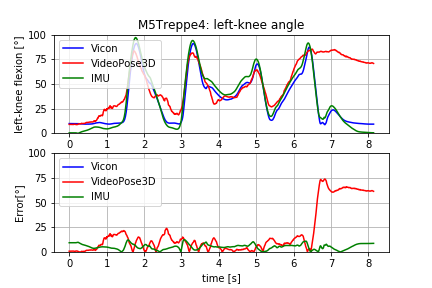

# Development and Evaluation of an Inexpensive IMU-based System for Gait Analysis

## Three Measurement Systems are evaluated and compared to one another:
* Vicon
* VideoPose3D
* IMU

## This repository contains:
* data: All measurement files are stored here.
* results: The results of the evaluation.
* src: source code for evaluation

## Example Results Knee Angle:

## Example Result Video:
